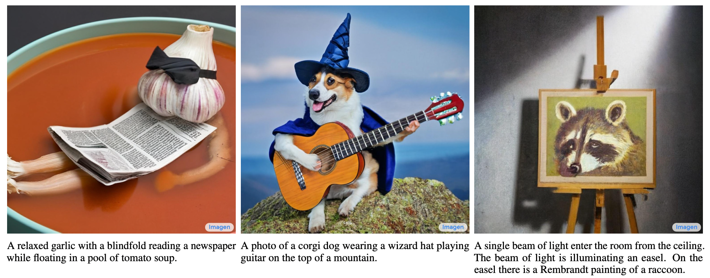
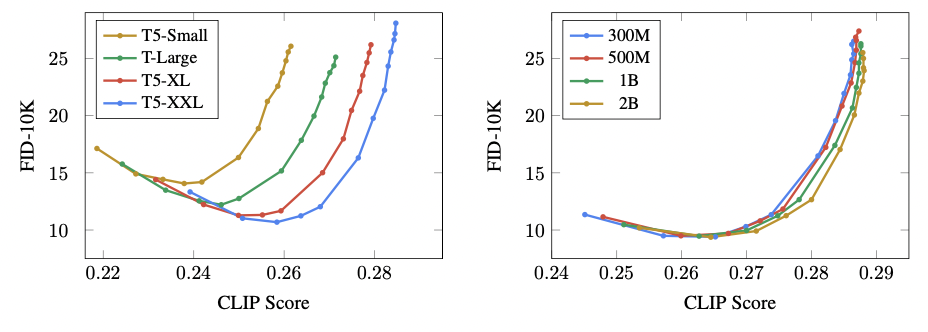
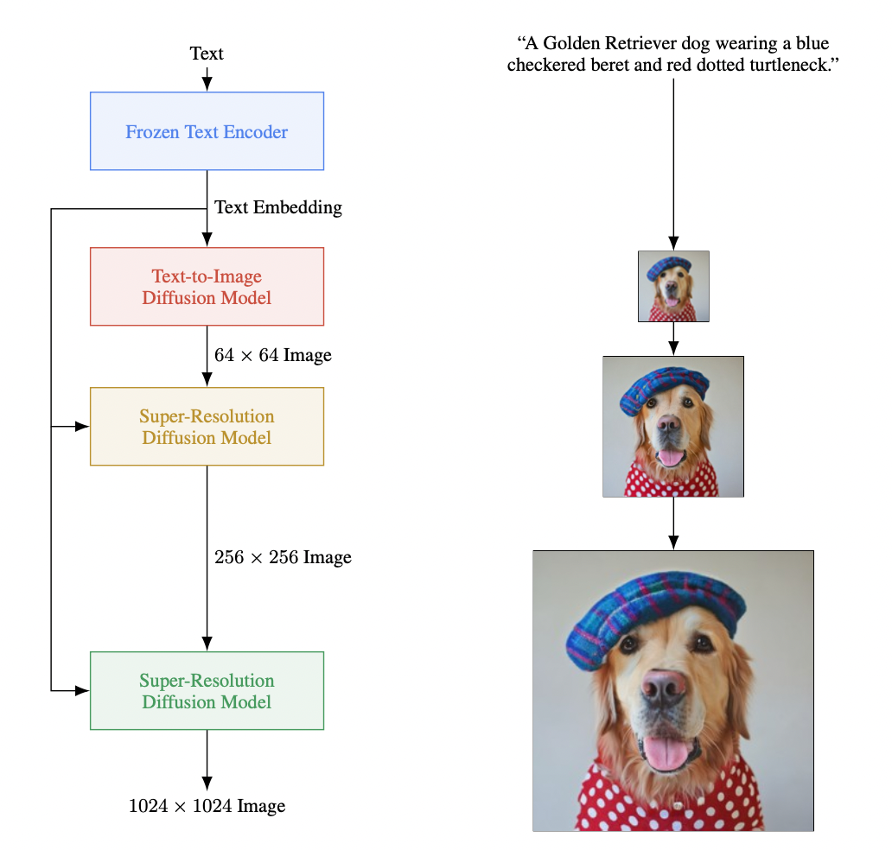

> This block is a brief introduction of your project. You can put your abstract here or any headers you want the readers to know.


<!--more-->
{: class="table-of-content"}
* TOC
{:toc}

---  

## Main Content
Your survey starts here. You can refer to the [source code](https://github.com/lilianweng/lil-log/tree/master/_posts) of [lil's blogs](https://lilianweng.github.io/lil-log/) for article structure ideas or Markdown syntax. We've provided a [sample post](https://ucladeepvision.github.io/CS188-Projects-2022Winter/2017/06/21/an-overview-of-deep-learning.html) from Lilian Weng and you can find the source code [here](https://raw.githubusercontent.com/UCLAdeepvision/CS188-Projects-2022Winter/main/_posts/2017-06-21-an-overview-of-deep-learning.md)

## Basic Syntax
### Image
Please create a folder with the name of your team id under /assets/images/, put all your images into the folder and reference the images in your main content.

You can add an image to your survey like this:

{: style="width: 400px; max-width: 100%;"}
*Fig 1. YOLO: An object detection method in computer vision* [1].

Please cite the image if it is taken from other people's work.


### Table
Here is an example for creating tables, including alignment syntax.

|             | column 1    |  column 2     |
| :---        |    :----:   |          ---: |
| row1        | Text        | Text          |
| row2        | Text        | Text          |


### Code Block
```
# This is a sample code block
import torch
print (torch.__version__)
```


### Formula
Please use latex to generate formulas, such as:

$$
\tilde{\mathbf{z}}^{(t)}_i = \frac{\alpha \tilde{\mathbf{z}}^{(t-1)}_i + (1-\alpha) \mathbf{z}_i}{1-\alpha^t}
$$

or you can write in-text formula $$y = wx + b$$.

### More Markdown Syntax
You can find more Markdown syntax at [this page](https://www.markdownguide.org/basic-syntax/).

# Imagen: LLM + Diffusion Model
Imagen is a powerful text-to-image generation model developed by Google Brain which, at the time of its release, held the State of the Art performance on a variety of metrics, including the COCO FID benchmark. Key features of this innovative model are:  
- LLM for text encoder
- Efficient UNet backbone
- Classifier-free guidance with dynamic thresholding
- Noise augmentation and conditioning in cascading diffusion models

{: style="width: 680px; max-width: 100%;"}    
*Fig XX. Examples of Imagen Generation* [x]   

## Revisiting Diffusion Models
In Stable Diffusion, text conditioning is done via a separate transformer that encodes text prompts into the latent space of the diffusion model. These encoders are trained jointly with the diffusion backbone on pairs of images and their text captions. Thus, the text encoders are only exposed to a limited set of text data that is constrained to the space of image captioning and descriptors.  
  
Although this method of jointly training a text encoder and diffusion model works well in practice, Imagen finds that using pre-trained large-language models has much better performance. In fact, Imagen uses the largest language model available at the time (T5-XXL) which is a general language model. The advantages of this approach are twofold, there is no need to train a dedicated encoder, and general encoders learn much better semantic information.  
  
Not requiring a dedicated encoder makes the training process much easier, it is one less model that needs to be optimized. Using a separate and pre-trained model also allows training data to be directly encoded once, simplifying expensive computation that would have to be done for each training step. The Imagen authors state that text data is encoded one time, and that during training, the model can directly use (image, encoding) pairs rather than deriving encodings at every iteration from (image, text) pairs.  
  
In addition, using pre-trained LLM allows the generative model to capitalize on important semantic representations already encoded and learned from vast datasets. Simply put, pre-trained models have a much better understanding of language since they are trained on much larger and richer data than dedicated diffusion text encoders.   
  
The Imagen authors also report surprising results ‒ that the size of the language model has a direct correlation with better generative features. Scaling up the language model even has a much larger impact on generative capabilities than scaling the diffusion model itself.  

{: style="width: 500px; max-width: 100%;"}  
*Fig XX. Imagen Experiments with Varying LLM and UNet size* [x].  

These charts, from the Imagen paper, show the model capabilities for varying sizes of LLM text encoders (on the left) and UNet diffusion models (on the right). Evidently, increasing the size of the text encoder has a much more drastic improvement on evaluation metrics than increasing the size of the diffusion backbone. A bigger text encoder equals a better generative model.   
  
Imagen also adapts the diffusion backbone itself, introducing a new variant they call Efficient UNet. This version of the UNet model has considerably better memory efficiency, inference time, and convergence speed, being 2-3x faster than other UNets. Better sample quality and faster inference is essential for generative performance and training.  

## Further Optimizations
Imagen also introduces several other novel optimizations for the training process on top of revamping the diffusion backbone and text encoder. These optimizations include dynamic thresholding to enable aggressive classifier-free guidance as well as injecting noise augmentation and conditioning to boost upsampling quality.  
  
Classifier-free guidance is a technique used to improve the quality of text conditional training in diffusion models. Its counterpart, classifier guidance, has the effect of improving sample quality while reducing diversity in conditional diffusion. However, classifier guidance involves pre-trained models that themselves need to be optimized. Classifier-free guidance is an alternative that avoids pre-trained models by jointly training a single diffusion model on conditional and unconditional objectives by randomly dropping the condition during training. The strength of classifier-free guidance is also controlled by a weight parameter.  
  
Larger weights of classifier-free guidance improves text-image alignment but results in very saturated and unnatural images. Imagen addresses this issue with dynamic thresholding. In short, large weights on guidance pushes the values of the predicted image outside of the bounds of the training data (which are between -1, and 1). Runaway values lead to saturation. Dynamic thresholding constraints large values in the predicted image so that the resulting images are not overly saturated. The use of dynamic thresholding thus allows the use of aggressive guidance weights, which improve the model quality without leading to unnatural images.  
  
In addition, the Imagen architecture also implements cascading diffusion models. The first DM generates a 64x64 image, then the second upsamples to 256x256, and the final upsamples to 1024x1024. This cascading method results in very high fidelity images. Imagen further builds on this capability by introducing noise conditioning and augmentations in the cascading steps.   
  
Noise augmentation adds a random amount of noise to intermediate images between upsampling. Noise conditioning in the upsampling models means that the amount of noise added in the form of augmentations is provided as a further condition to the upsampling model.  
  
These techniques, taken together, boost the quality produced by the final Imagen model.  
  
## Overview of Imagen Architecture
First, text prompts are passed to a frozen text encoder that results in embeddings. These embeddings are inputs into a text-to-image diffusion model that outputs a 64x64 image.  
  
Then, the image is upsampled via two super-resolution models that create the final 1024x1024 image.   

{: style="width: 500px; max-width: 100%;"}  
*Fig XX. Imagen Architecture* [x].    


# References  
[x] Chitwan Saharia, William Chan, Saurabh Saxena, Lala Li, Jay Whang, Emily L. Denton, Kamyar Ghasemipour, Raphael Gontijo Lopes, Burcu Karagol Ayan, Tim Salimans, Jonathan Ho, David J. Fleet, and Mohammad Norouzi. ["Photorealistic text-to-image diffusion models with deep language understanding."](https://arxiv.org/abs/2205.11487) *arXiv preprint arXiv:2205.11487* (2022).

---
